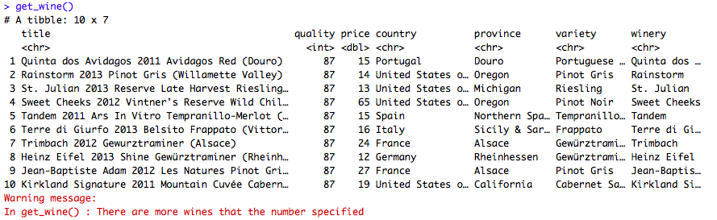
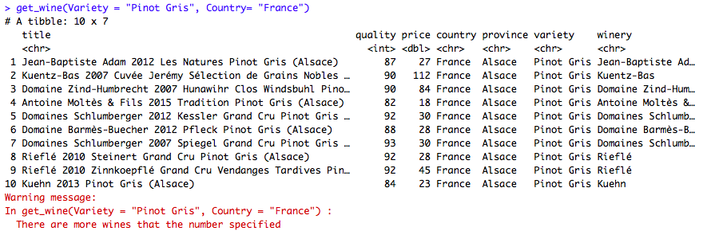
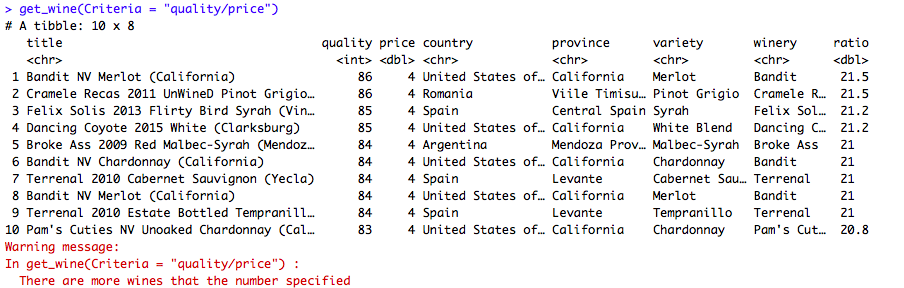
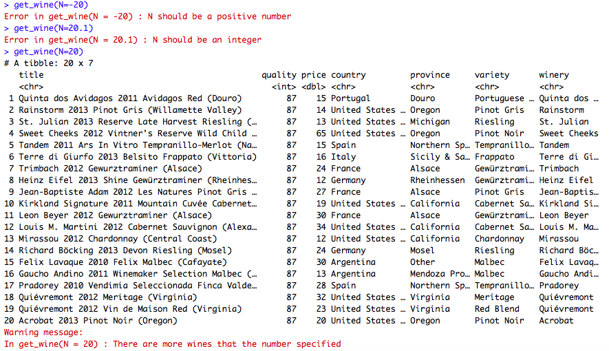
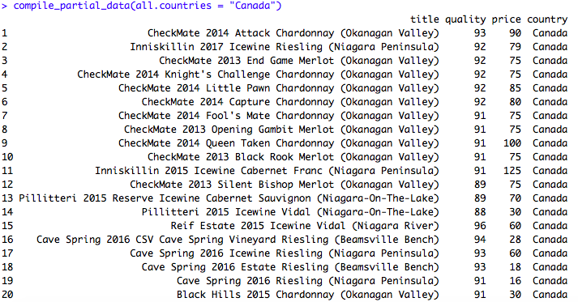
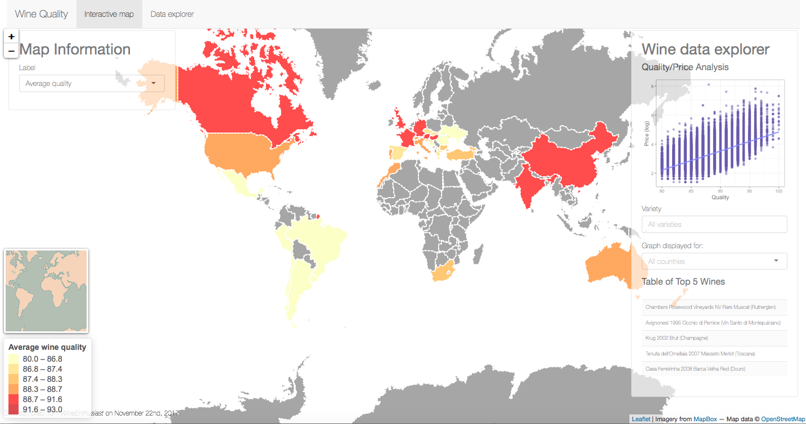

```{r setup, warning=FALSE, message=FALSE, include=FALSE}

```

# Introduction

## {.flexbox .vcenter}

<div class="centered">
Our main goal was to create an <span style="font-weight:bold">interactive map
</span> of wine reviews all over the world, that allows the user to easily find 
information about different wines and compare price and quality. 
</div>


## Project Design

  * Data preparation
  * Build a package 
    * R functions
    * Use Shiny app to create the interactive map highlighting the countries
    that produce wine and coloring them according to the average wine quality
    in each country
    * Include in the dashboard interactive graphs and filters that allows to 
    search information about different wines


# Data Description 

## Dataset used
<small style="font-size:.8em">
  
<span style="font-weight:bold">WineEnthusiast review data (2017)</span> <br />
<span style="font-size:.7em">retrieved from:
[Kaggle](https://www.kaggle.com/zynicide/wine-reviews/)</span>

  * Wine reviews
  * 129971 observations
  * 14 variables 
  
<br />
<br />   
<span style="font-weight:bold">SpatialPolygonsDataFrame</span>

  * Coordinates of country boarders. 


</small>


# Functions
## Functions 
<small style="font-size:.6em">
**get_wine()**: Retrieves the best wine from the wine review data <br />

 <center></center>  <br />
 </small>
<small style="font-size:.6em">
 <center></center>
</small>

##
<center></center> <br />
<center></center>

## Web Scraping

<center></center>

# Interactive map <br /> (Shiny app)


## Dashboard 

  
<center></center> <br />


# Project Limitations

## {.flexbox .vcenter}
  <small style="font-size:.8em">
 
  * Limited number of reviews.
  * Reviews are subjective.
  * Cannot retrieve all informations from web scraping.
  * Takes time when you retrieve the data from winemag (≈ 3 hours). 

</small>
 

# Thank you ! 
